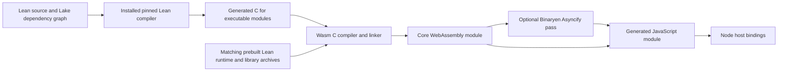

# Lasm implementation plan

## Current product plan — 2026-09-23

This is the agreed product direction and acceptance plan, not a claim that every
requirement is implemented. It supersedes conflicting decisions in the historical
plan retained below. Updating this document does not start or stop running work.

Lasm compiles ordinary Lean applications ahead of time:

```text
Native Lean/Lake + managed build tools
→ application Wasm + JavaScript loaders and host support
→ Node, Deno, or Bun
```

Running the Lean compiler itself in Wasm remains separate research. The default
product compiles and executes the application, rather than interpreting its source
through a Wasm Lean compiler.

Node, Deno, and Bun are the current deployment targets. Browser support is deferred;
preserve existing browser work without making it a current implementation gate.

### Complete Lean compatibility

The goal is the entire Lean language and all standard libraries and APIs in each
of Node, Deno, and Bun. Begin explicit support and testing with the latest stable
published Lean release and the latest stable published releases of all three
engines, across the six required operating-system/architecture combinations.
This includes all of `IO.FS`, `Std.Http`, async/concurrency, and the other shipped
library APIs, not merely the subset exercised by existing examples or tests.
Preserve native Lean behavior on the corresponding operating system, including
errors, resource lifetime, and concurrency semantics. Supporting additional Lean
versions remains possible through version selection; it must not delay this
initial latest-release acceptance goal.

Continue fixing all nonfundamental gaps. Missing implementations, difficult
engineering, unavailable test runners, engine bugs, packaging work, timeouts, or
resource aborts are not evidence of a fundamental limitation. Do not hide gaps
behind stubs, weakened tests, or reduced acceptance scope.

If full compatibility is blocked by a demonstrated fundamental limitation, work
may stop and the blocker must be reported. Include a reproducible case, native
versus target behavior, affected APIs/platforms, and why permitted Wasm, host
adapter, and managed native-helper approaches cannot resolve it. Respect resource
safety limits throughout; a safety stop is not a compatibility conclusion.

### Installation and build platforms

- Developers install only Node/npm. Lasm automatically supplies pinned native
  Lean/Lake, compiler/linker tools, libraries, and every supporting dependency in
  a managed local cache. No manual SDK setup or global system changes.
- Verify downloads and cache contents, preserve redistribution notices, and record
  resolved tool versions and checksums for reproducibility.
- Compilation must work on Windows, macOS, and Linux, each on x86-64 and ARM64.
  Verify all six combinations; report missing native validation explicitly.
- Use ordinary Lean files, Lake projects, standard APIs, and main entry points.
  Ordinary applications require no Lasm-specific Lean APIs, annotations, or
  configuration.

### Developer API

```sh
npx lasm Main.lean
npx lasm build Main.lean
```

`lasm Main.lean` provisions tools as needed, discovers Lake, compiles into its
build cache, and immediately runs the compiled application. Unchanged runs reuse
the cache. `lasm build Main.lean` uses the same compilation pipeline and produces
deployable files in `dist/`; it does not run the application.

Both commands accept `--target node|deno|bun`, defaulting to `node`:

```sh
npx lasm Main.lean --target deno
npx lasm Main.lean --target bun
npx lasm build Main.lean --target bun
```

Application arguments follow `--`, for example `npx lasm Main.lean -- hello`.
Keep callable Lean libraries with generated JavaScript bindings and TypeScript
declarations. Engine-specific launcher filenames are compatibility entry points,
not the primary getting-started workflow.

### Version policy

- Target the latest published stable releases, excluding release candidates,
  nightlies, canaries, and locally patched engines. For Node this means the latest
  Current release, not an older LTS release merely because it is the default
  download. Recheck official release sources when starting a new acceptance
  campaign; record exact versions and keep them fixed throughout that campaign.
- The initial latest-release baseline verified on 2026-09-23 is:

  | Component | Required acceptance version | Official source |
  | --- | --- | --- |
  | Lean | 4.34.0 | [Release](https://github.com/leanprover/lean4/releases/tag/v4.34.0) |
  | Node | 26.10.0 | [Current release](https://nodejs.org/en/blog/release/v26.10.0) |
  | Deno | 2.9.7 | [Release](https://github.com/denoland/deno/releases/tag/v2.9.7) |
  | Bun | 1.4.2 | [Release](https://github.com/oven-sh/bun/releases/tag/bun-v1.4.2) |

  These are acceptance targets, not claims of completed Lasm validation. Earlier
  Lean 4.32.0 / Node 24.13.1 results keep their original scope. New upstream
  releases require fresh compatibility work and evidence, not relabeled passes.
  The 2026-09-25 UTC refresh found Lean 4.34.1, published September 24; it is now
  the latest-release acceptance target. The three engine versions are unchanged.
  [Native bootstrap and patch regressions pass](evidence/lean-4.34.1-native-bootstrap-2026-09-25.json)
  on Linux x64. The [complete runtime rebuild](evidence/lean-4.34.1-runtime-build-2026-09-25.json)
  now passes. Fresh [installed main comparisons](evidence/lean-4.34.1-installed-main-2026-09-25.json)
  pass in all three engines, and a Linux x64 [cold installation and isolated
  deployment](evidence/lean-4.34.1-cold-install-2026-09-25.json) pass in Node.
  Broader suite, API and platform acceptance remains pending;
  existing 4.34.0 evidence and the validated default retain their original scope.
- Select Lean through the standard `lean-toolchain` file, for example
  `leanprover/lean4:v4.34.0`. Preserve the ability to change Lean versions and
  manage matching compiler/runtime/library artifacts per version; do not make
  the architecture permanently depend on one hardcoded Lean release. Start with
  explicit support for the latest stable release. Without a pin, use the Lasm
  release's documented, validated default. Reject versions without a working
  matching implementation clearly; never silently change a project's pin.
- Do not add Node, Deno, or Bun version-selection syntax or a runtime
  version manager. `--target` selects the environment only. Use the installed
  selected engine; report a missing engine clearly.
- Check runtime compatibility and document a tested engine support matrix.
  Building a target does not require its execution engine to be installed.
- Lasm manages compiler/linker, sysroot, runtime-library, and optimizer versions
  internally. Record build inputs; invalidate caches when relevant inputs change.

### Deployment

The application entry point is `dist/main.mjs`. Run output built for the selected
environment normally:

```sh
node dist/main.mjs
deno run -A dist/main.mjs
bun dist/main.mjs
```

Deno permissions may be narrowed to the application's needs. Running requires
the selected engine; building any target requires only Node/npm.

Deploy the complete `dist/` directory, including Wasm, loaders, workers, assets,
and necessary host support. Execution must not depend on build tools, source
files, this checkout, or absolute development paths.

The target selects adapters and Wasm features. Reuse artifacts where compatible;
do not require one universal binary. Native build-time plugins may execute on the
build machine; foreign code needed by the deployed application requires a Wasm
implementation or host adapter. All shipped standard-library dependencies are
part of the full-compatibility goal.

### Implementation and validation

Preserve the compiler-in-Wasm work and evidence. Reuse its proven runtime, IO,
async, threading, ABI, and linking improvements. Do not revert to the older
limited implementation merely to simplify packaging. Select memory width and
threading by application requirements and verified target support.

Validate the shipping pipeline with:

- Clean installation with only Node/npm present, automatic tool provisioning,
  and ordinary Lake dependency builds.
- Native-versus-compiled-Wasm behavior across the entire language and standard
  API surface, including console, filesystem, HTTP, async, errors, and cleanup.
- The existing all-Lean HTTP server and Express/Lean examples, plus callable
  library bindings.
- Deployment into a separate environment without source or build tools.
- Stock Node, Deno, Bun, and native CI coverage for all six build
  platforms. Label unverified platforms and emulation explicitly.
- Inventory the entire unchanged upstream Lean suite. Execute application/runtime
  checks through the shipping compiled-application path and identify native
  build-time/compiler checks separately. Keep compiler-in-Wasm results separate
  from application compatibility claims. Preserve original tests and expected
  outputs; document parallel harness adaptations and remaining gaps.
- Audit all standard APIs and add meaningful differential coverage where the
  upstream suite lacks it. Passing the suite alone does not prove complete API
  compatibility.

When the working implementation task adopts this plan, finish its current test,
checkpoint/pause broad compiler-in-Wasm campaigns, and prioritize this product
pipeline. Preserve evidence and follow the existing resource guard and
single-heavy-workload rules. Do not risk another OOM.

### GitHub Actions CI/CD authority and cost limit

GitHub Actions is essential to native macOS and Windows acceptance, and to the
full Linux/macOS/Windows × x86-64/ARM64 matrix. Codex is authorized to create,
modify, enable, dispatch, rerun, cancel, inspect, and repair workflows; configure
relevant Actions settings; and manage this repository's CI artifacts and caches
as needed without repeated permission, provided these actions incur no additional
cost under the user's current plan and public open-source repository allowance.
This includes selecting matrices, splitting workloads, adjusting timeouts, and
building/testing release candidates. Resolve and test the latest stable Lean and
engine versions in CI, while recording exact resolved versions for each run.

Use standard GitHub-hosted runners covered by the public-repository allowance.
The [GitHub runner reference](https://docs.github.com/en/actions/reference/runners/github-hosted-runners)
lists native standard runners for all six required combinations. Preserve
resource safety on each runner; fit or split workloads within its actual memory,
disk, and job limits rather than moving to paid larger runners.

The no-extra-cost condition is mandatory. Do not enable paid/larger runners,
upgrades, paid third-party services, or chargeable overages. Verify free/included
eligibility before using a feature. Bound artifact size and retention and cache
usage to the current included allowances, accounting for shared storage usage.
Clean up this repository's disposable CI data as needed while preserving required
evidence. If a feature cannot be confirmed free or included, use a verified
no-cost alternative and continue unaffected work.

As checked on 2026-09-23, standard hosted runner compute is free for public
repositories, while larger runners are charged and excess artifact/cache storage
can be billed. Recheck [GitHub's billing rules](https://docs.github.com/en/billing/concepts/product-billing/github-actions)
when making cost-sensitive changes; do not equate public-repository compute with
unlimited free storage. CI/CD authority does not itself authorize npm publication.

### Git workflow and delivery

Implement and verify a reproducible local package. Keep work on `main` and make
meaningful unsigned commits. Never GPG-sign commits; use
`git -c commit.gpgsign=false commit` and disable commit signing in local config.

The authorized remote is `git@github.com:Millillion/lasm.git`, named `origin`.
Configure it and track `origin/main`. Push after every commit and keep local and
remote history synchronized without force-pushing or discarding remote work.

Push failures must not pause development: report the failure, keep implementing
and committing locally, and push the backlog when access is restored. If SSH
authentication expires, stop attempting authenticated pushes until the user
restores credentials; continue local work. Transient network or remote failures
likewise must not block local progress. Never request or expose private keys.

Git pushes are authorized; npm publication is not. Use a local tarball until
package publication is explicitly authorized.

### Progress snapshot at every commit

Before every commit, create or update `docs/PROGRESS.md` and include the update
in that same commit. Keep the snapshot under 150 words using this format; the
numbers below illustrate the initial provisional assessment, not fixed scores:

> **Completion:** ~50% — unchanged since previous commit.
>
> **Estimated finish:** [date and time, Eastern] — [low/medium/high confidence]; likely window: [date range].
>
> **Changed:** One sentence describing newly completed and verified work, with an evidence link.
>
> **Remaining:** The three biggest unfinished items.
>
> **Score basis:** Workflow 80%; Wasm execution 45%; API parity 25%; platform acceptance 40%.

Calculate completion using these weights: **workflow 25%, Wasm execution 30%,
API parity 25%, platform acceptance 20%**. Round the overall result to the nearest
five percentage points; reserve 100% for completed acceptance.

Estimate the finish from remaining milestones and observed delivery pace, not by
extrapolating the completion percentage. State any major assumption affecting the
forecast. If a date cannot be supported, say "not yet estimable" and identify the
blocker.

Scores may rise or fall with evidence. Native compiler passes do not count as
Wasm execution passes. Refine the heuristic when needed, briefly distinguishing
scoring changes from actual progress.

---

# Historical implementation plan — 2026-09-17

The following material records the earlier plan and its historical implementation
claims. It is retained for context, not as the current product contract. The plan
above governs where the two differ.

Status: the user accepted these recommendations on 2026-09-17. The experimental
runtime, callable modules, Lean IO, Lake integration, local release packaging,
and browser/Workers adapters are implemented. Validation covers Linux x64 builds,
Node 24.13.1, real Chrome, and local Cloudflare workerd. See [RUNTIME.md](RUNTIME.md),
[IO.md](IO.md), [DEVELOPER_WORKFLOW.md](DEVELOPER_WORKFLOW.md), [RELEASE.md](RELEASE.md),
and [HOSTS.md](HOSTS.md) for the exact tested scope. Broader Lean/OS compatibility
and live cloud deployment are outside this first experimental release.

## Intended product

Keep the original goal: a developer with Lean and Node installs `@lasm/compiler`,
builds a Lean project, and imports its generated Wasm-backed module from ordinary
Node code. Running the built artifact should require Node and the small runtime
wrapper, not Lean, Zig, or a compiler installation.

Start with callable Lean functions. A `main` runner can be an adapter over the
same initialized instance. This direction was accepted with the plan.

## Proposed architecture



1. **Host compiler:** use the project's exact elan/Lake toolchain to elaborate and
   emit C. Run subprocesses with argument arrays. Honor the project's dependency
   graph and compiler options; compiling one source file is only the simplest case.
2. **Target artifacts:** maintain prebuilt wasm32 Lean runtime and required
   `Init`/`Std` code for one exact Lean version first. Include matching target
   headers and allocator configuration. Compile executable third-party Lean
   dependencies as needed; arbitrary native `@[extern]` code needs explicit ports.
3. **C/C++ toolchain:** use pinned Zig as the working reference. Evaluate Lean's
   bundled Clang/LLD plus a distributed Wasm sysroot before committing to a large
   per-platform Zig package. The release build can use heavier tooling than the
   developer-facing package requires.
4. **Output:** prefer a core Wasm module initialized as a reusable library, with
   generated ESM glue and eventually TypeScript declarations. A component-model
   backend can be a separate future target if actual users need it.
5. **Host interface:** define a versioned Lasm API for high-level operations, with
   JS adapters per host. Keep any residual libc/WASI imports explicit and tested.
   Do not make eliminating every WASI import a prerequisite to the first runtime
   milestone; compare that cost after measuring the reachable dependencies.
6. **Async:** use an Asyncify build for the initial flag-free Node baseline and an
   optional JSPI build for compatible engines. Keep the public JS API consistent,
   while allowing different Wasm artifacts and drivers. Feature-detect support
   and test real suspensions; neither API presence nor target naming is sufficient.

## Runtime and ABI scope

Use Lean's existing bignum fallback (`USE_GMP=OFF`) and investigate the existing
single-thread configuration. Preserve Lean's `Nat`/`Int` semantics. Do not claim
support for OS processes, native sockets/TLS, every `Std.Async` operation, or
parallel Lean tasks in the first release. Unsupported functionality should give
a clear diagnostic or explicit unsupported-operation error, not silently succeed.

Expose a small, documented set of JS-visible argument/result types first. Scalars
are easy; strings, bytes, arbitrary integers, records, and errors need conversion
and ownership rules. Avoid exposing raw `lean_object*` as the public JS interface.
Respect Lean's reference counts on both successful and failed calls.

Specify pointer/length validation, UTF-8, memory ownership, result handles, and
cleanup at the host boundary. Copy or retain inputs correctly across `await`, and
reacquire typed-array views after memory growth. Avoid reentering a suspended
guest merely to allocate a result. Start with at most one active async execution
per instance, using a clear queue or rejection policy; multiple instances can
provide concurrency.

For IO, separate two promises that the thread blurred:

- A small Lasm API for reading/writing bytes and making a host `fetch` request is
  controllable and portable to JS hosts.
- Transparent compatibility with existing `IO.FS`, processes, sockets, and
  `Std.Async` is a wider project involving handles, initialization, errors,
  scheduling, and native dependencies.

Recommend the small explicit API first, with a documented subset of standard
Lean IO added where it materially helps. The final public names remain open.
Hosts should provide operations explicitly, so filesystem availability and HTTP
behavior can differ honestly between Node, browsers, and cloud workers.

## Implementation milestones and acceptance gates

### 0. Research baseline — completed in this repository

Repository setup, full displayed-thread review, source checks, scalar Wasm
execution, import inspection, async C host probes, and runtime translation-unit
checks are committed. See [FEASIBILITY.md](FEASIBILITY.md) for precise limits.

### 1. Real Lean runtime and library slice — core slice validated

Pin Lean 4.32.0 for the initial experiment. Build the actual runtime core and
required Lean-generated libraries for wasm32 with a target-specific configuration.
Document each required platform adaptation, initialization step, and import.
Compare a minimal WASI compatibility layer against replacing the reachable IO
primitives. Keep the investigation bounded to a representative library program.

Acceptance:

- Native/Wasm differential cases for numbers beyond 64 bits, negative integers,
  arrays, Unicode strings, inductive values, and higher-order functions.
- A real imported Lean module and its initialization execute correctly.
- Repeated calls and separate instances preserve results and bound live resource
  growth; failures release resources appropriately.
- All imports match a declared allowlist. No blanket unresolved-symbol imports
  or fake implementations used to make a test pass.
- Record stripped module size, initialization time, memory behavior, and the
  patch/dependency inventory before choosing the release toolchain.

If a direct Zig build requires invasive runtime changes, compare an Emscripten
reference build. It can remain a maintainer tool; users need not manually install
it. Choose the route with measured complexity and package-size benefits.

### 2. Stable callable module and lifecycle — experimental implementation

Define explicit exports and conversions for the initial type set. Generate a
small module factory that initializes a fresh instance and its Lean modules.
Specify error propagation, disposal, supported reentry, and async serialization.
Keep `main` invocation as an adapter if that matches the user's preferred first
experience. Validate pure and heap-using calls from a separate Node project.

### 3. Filesystem and HTTP vertical slice — implemented and tested on Node

Implement Node host bindings for a bounded filesystem API, then `fetch` requests
and byte responses. Exercise these from actual Lean `IO`, not merely a C probe.
Choose deliberately how much `IO.FS` compatibility is included.

Acceptance: binary and UTF-8 data; missing-file/permission errors; repeated calls;
successful and failed HTTP; redirects according to the declared policy; request
and response limits; cancellation behavior; correct cleanup. Test Asyncify
through Lean closures/indirect calls and across consecutive suspensions. Verify
the same public interface against the optional JSPI build.

### 4. Package and installation experience — implemented for Linux x64

Split build dependencies from the runtime needed by a deployed application.
Package version-matched target archives, headers/sysroot, the compiler adapter,
and Binaryen if the selected build needs it. If a native toolchain must be
distributed, use pinned platform packages with `os`/`cpu` metadata and clear
diagnostics when optional packages have been omitted.

Acceptance implemented: fresh npm/pnpm/Yarn project directories and empty caches,
offline local-tarball installation, multi-module Lake builds, paths with spaces,
locked reinstalls, deterministic rebuilds, and execution without compiler tools.
Build PATH is restricted to Node, Lean, Lake, and ordinary shell utilities. Tests
reject unsupported platform combinations, injected mismatching Lean identities,
and damaged target archives. Reports measure compressed/installed sizes and
install/first/cached-build time. Shipped inputs include redistribution notices.
These are isolated tests on the development Linux host. macOS/Windows tool
adapters and a native OS/architecture acceptance matrix are now implemented;
native validation beyond Linux x64 remains open in [NEXT_STEPS.md](../NEXT_STEPS.md).

### 5. Browser and cloud adapters — tested in Chrome and local workerd

Reuse the same ABI and, where feature support permits, the same artifact. Test
real target environments for memory limits, async engine support, module-loading
requirements, and filesystem differences. Do not promise every Wasm host can run
a module that expects JavaScript imports. WASI/component support is a distinct
possible extension, not automatic portability.

The Asyncify artifact now runs through a portable WASI adapter in real Chrome
with IndexedDB/fetch, and through a static Wasm import in local Cloudflare workerd
with KV/service bindings. Host capabilities are explicitly supplied. See
[HOSTS.md](HOSTS.md) for loading, limits, and the runnable acceptance suite.

## Accepted directions

| Decision | Accepted direction | Remaining implementation evidence |
| --- | --- | --- |
| Callable functions versus a `main` runner | Callable functions first, with a later/simple `main` adapter | Typed callable interface implemented; runner remains an adapter to add. |
| Existing Lean IO compatibility | Small explicit Lasm API first, then useful standard IO subsets | Full compatibility enlarges the runtime and async scope considerably. |
| Custom-only versus hybrid internal imports | Keep the public host API custom; permit a measured minimal WASI layer internally | Final runtime reachability has not been established. |
| Bundled compiler choice | Zig builds maintainer archives; installed Lean Clang/LLD uses the packaged sysroot | Linux x64 passes; macOS/Windows adapters are implemented but native acceptance is pending. |
| Minimum Node/Lean versions | One exact Lean release and an explicit Node baseline initially | Versioned native/runtime ABI compatibility must be maintained and tested. |
| Meaning of lightweight | Prioritize simple setup, then measure download and runtime footprint separately | The thread specifies convenience but no numeric size budget. |

The three remaining items tracked in [NEXT_STEPS.md](../NEXT_STEPS.md) are complete
within the supported matrix above. Potential later work includes a `main` runner,
additional boundary types and host APIs, more build platforms/browser engines,
and production performance and operational validation.
