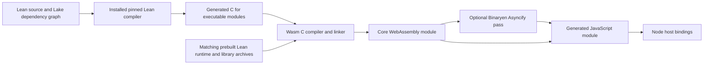

# Lasm implementation plan

Status: the user accepted these recommendations on 2026-09-17. The experimental
runtime, callable modules, Lean IO, Lake integration, local release packaging,
and browser/Workers adapters are implemented. Validation covers Linux x64 builds,
Node 24.13.1, real Chrome, and local Cloudflare workerd. See [RUNTIME.md](RUNTIME.md),
[IO.md](IO.md), [DEVELOPER_WORKFLOW.md](DEVELOPER_WORKFLOW.md), [RELEASE.md](RELEASE.md),
and [HOSTS.md](HOSTS.md) for the exact tested scope. Broader Lean/OS compatibility
and live cloud deployment are outside this first experimental release.

## Intended product

Keep the original goal: a developer with Lean and Node installs `@lasm/compiler`,
builds a Lean project, and imports its generated Wasm-backed module from ordinary
Node code. Running the built artifact should require Node and the small runtime
wrapper, not Lean, Zig, or a compiler installation.

Start with callable Lean functions. A `main` runner can be an adapter over the
same initialized instance. This direction was accepted with the plan.

## Proposed architecture

1. **Host compiler:** use the project's exact elan/Lake toolchain to elaborate and
   emit C. Run subprocesses with argument arrays. Honor the project's dependency
   graph and compiler options; compiling one source file is only the simplest case.
2. **Target artifacts:** maintain prebuilt wasm32 Lean runtime and required
   `Init`/`Std` code for one exact Lean version first. Include matching target
   headers and allocator configuration. Compile executable third-party Lean
   dependencies as needed; arbitrary native `@[extern]` code needs explicit ports.
3. **C/C++ toolchain:** use pinned Zig as the working reference. Evaluate Lean's
   bundled Clang/LLD plus a distributed Wasm sysroot before committing to a large
   per-platform Zig package. The release build can use heavier tooling than the
   developer-facing package requires.
4. **Output:** prefer a core Wasm module initialized as a reusable library, with
   generated ESM glue and eventually TypeScript declarations. A component-model
   backend can be a separate future target if actual users need it.
5. **Host interface:** define a versioned Lasm API for high-level operations, with
   JS adapters per host. Keep any residual libc/WASI imports explicit and tested.
   Do not make eliminating every WASI import a prerequisite to the first runtime
   milestone; compare that cost after measuring the reachable dependencies.
6. **Async:** use an Asyncify build for the initial flag-free Node baseline and an
   optional JSPI build for compatible engines. Keep the public JS API consistent,
   while allowing different Wasm artifacts and drivers. Feature-detect support
   and test real suspensions; neither API presence nor target naming is sufficient.

## Runtime and ABI scope

Use Lean's existing bignum fallback (`USE_GMP=OFF`) and investigate the existing
single-thread configuration. Preserve Lean's `Nat`/`Int` semantics. Do not claim
support for OS processes, native sockets/TLS, every `Std.Async` operation, or
parallel Lean tasks in the first release. Unsupported functionality should give
a clear diagnostic or explicit unsupported-operation error, not silently succeed.

Expose a small, documented set of JS-visible argument/result types first. Scalars
are easy; strings, bytes, arbitrary integers, records, and errors need conversion
and ownership rules. Avoid exposing raw `lean_object*` as the public JS interface.
Respect Lean's reference counts on both successful and failed calls.

Specify pointer/length validation, UTF-8, memory ownership, result handles, and
cleanup at the host boundary. Copy or retain inputs correctly across `await`, and
reacquire typed-array views after memory growth. Avoid reentering a suspended
guest merely to allocate a result. Start with at most one active async execution
per instance, using a clear queue or rejection policy; multiple instances can
provide concurrency.

For IO, separate two promises that the thread blurred:

- A small Lasm API for reading/writing bytes and making a host `fetch` request is
  controllable and portable to JS hosts.
- Transparent compatibility with existing `IO.FS`, processes, sockets, and
  `Std.Async` is a wider project involving handles, initialization, errors,
  scheduling, and native dependencies.

Recommend the small explicit API first, with a documented subset of standard
Lean IO added where it materially helps. The final public names remain open.
Hosts should provide operations explicitly, so filesystem availability and HTTP
behavior can differ honestly between Node, browsers, and cloud workers.

## Implementation milestones and acceptance gates

### 0. Research baseline — completed in this repository

Repository setup, full displayed-thread review, source checks, scalar Wasm
execution, import inspection, async C host probes, and runtime translation-unit
checks are committed. See [FEASIBILITY.md](FEASIBILITY.md) for precise limits.

### 1. Real Lean runtime and library slice — core slice validated

Pin Lean 4.32.0 for the initial experiment. Build the actual runtime core and
required Lean-generated libraries for wasm32 with a target-specific configuration.
Document each required platform adaptation, initialization step, and import.
Compare a minimal WASI compatibility layer against replacing the reachable IO
primitives. Keep the investigation bounded to a representative library program.

Acceptance:

- Native/Wasm differential cases for numbers beyond 64 bits, negative integers,
  arrays, Unicode strings, inductive values, and higher-order functions.
- A real imported Lean module and its initialization execute correctly.
- Repeated calls and separate instances preserve results and bound live resource
  growth; failures release resources appropriately.
- All imports match a declared allowlist. No blanket unresolved-symbol imports
  or fake implementations used to make a test pass.
- Record stripped module size, initialization time, memory behavior, and the
  patch/dependency inventory before choosing the release toolchain.

If a direct Zig build requires invasive runtime changes, compare an Emscripten
reference build. It can remain a maintainer tool; users need not manually install
it. Choose the route with measured complexity and package-size benefits.

### 2. Stable callable module and lifecycle — experimental implementation

Define explicit exports and conversions for the initial type set. Generate a
small module factory that initializes a fresh instance and its Lean modules.
Specify error propagation, disposal, supported reentry, and async serialization.
Keep `main` invocation as an adapter if that matches the user's preferred first
experience. Validate pure and heap-using calls from a separate Node project.

### 3. Filesystem and HTTP vertical slice — implemented and tested on Node

Implement Node host bindings for a bounded filesystem API, then `fetch` requests
and byte responses. Exercise these from actual Lean `IO`, not merely a C probe.
Choose deliberately how much `IO.FS` compatibility is included.

Acceptance: binary and UTF-8 data; missing-file/permission errors; repeated calls;
successful and failed HTTP; redirects according to the declared policy; request
and response limits; cancellation behavior; correct cleanup. Test Asyncify
through Lean closures/indirect calls and across consecutive suspensions. Verify
the same public interface against the optional JSPI build.

### 4. Package and installation experience — implemented for Linux x64

Split build dependencies from the runtime needed by a deployed application.
Package version-matched target archives, headers/sysroot, the compiler adapter,
and Binaryen if the selected build needs it. If a native toolchain must be
distributed, use pinned platform packages with `os`/`cpu` metadata and clear
diagnostics when optional packages have been omitted.

Acceptance implemented: fresh npm/pnpm/Yarn project directories and empty caches,
offline local-tarball installation, multi-module Lake builds, paths with spaces,
locked reinstalls, deterministic rebuilds, and execution without compiler tools.
Build PATH is restricted to Node, Lean, Lake, and ordinary shell utilities. Tests
reject unsupported platform combinations, injected mismatching Lean identities,
and damaged target archives. Reports measure compressed/installed sizes and
install/first/cached-build time. Shipped inputs include redistribution notices.
These are isolated tests on the development Linux host. macOS/Windows tool
adapters and a native OS/architecture acceptance matrix are now implemented;
native validation beyond Linux x64 remains open in [NEXT_STEPS.md](../NEXT_STEPS.md).

### 5. Browser and cloud adapters — tested in Chrome and local workerd

Reuse the same ABI and, where feature support permits, the same artifact. Test
real target environments for memory limits, async engine support, module-loading
requirements, and filesystem differences. Do not promise every Wasm host can run
a module that expects JavaScript imports. WASI/component support is a distinct
possible extension, not automatic portability.

The Asyncify artifact now runs through a portable WASI adapter in real Chrome
with IndexedDB/fetch, and through a static Wasm import in local Cloudflare workerd
with KV/service bindings. Host capabilities are explicitly supplied. See
[HOSTS.md](HOSTS.md) for loading, limits, and the runnable acceptance suite.

## Accepted directions

| Decision | Accepted direction | Remaining implementation evidence |
| --- | --- | --- |
| Callable functions versus a `main` runner | Callable functions first, with a later/simple `main` adapter | Typed callable interface implemented; runner remains an adapter to add. |
| Existing Lean IO compatibility | Small explicit Lasm API first, then useful standard IO subsets | Full compatibility enlarges the runtime and async scope considerably. |
| Custom-only versus hybrid internal imports | Keep the public host API custom; permit a measured minimal WASI layer internally | Final runtime reachability has not been established. |
| Bundled compiler choice | Zig builds maintainer archives; installed Lean Clang/LLD uses the packaged sysroot | Linux x64 passes; macOS/Windows adapters are implemented but native acceptance is pending. |
| Minimum Node/Lean versions | One exact Lean release and an explicit Node baseline initially | Versioned native/runtime ABI compatibility must be maintained and tested. |
| Meaning of lightweight | Prioritize simple setup, then measure download and runtime footprint separately | The thread specifies convenience but no numeric size budget. |

The three remaining items tracked in [NEXT_STEPS.md](../NEXT_STEPS.md) are complete
within the supported matrix above. Potential later work includes a `main` runner,
additional boundary types and host APIs, more build platforms/browser engines,
and production performance and operational validation.
